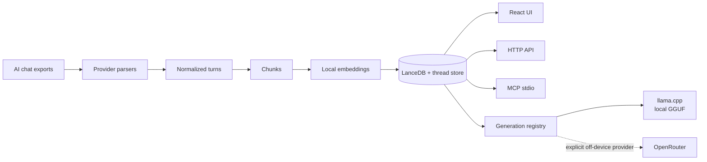
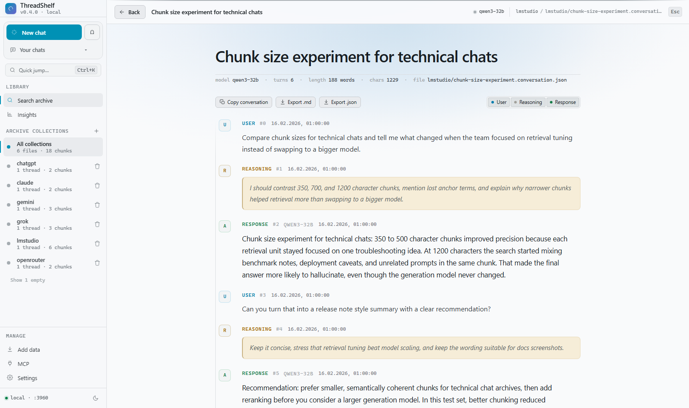
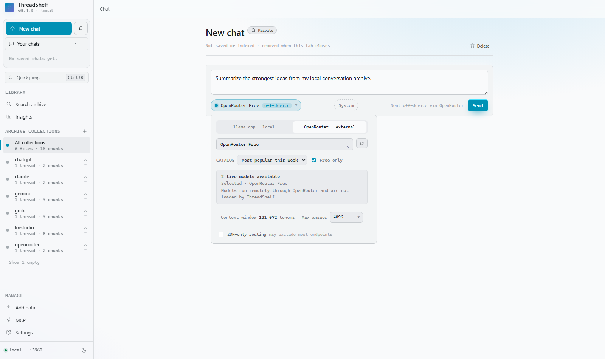
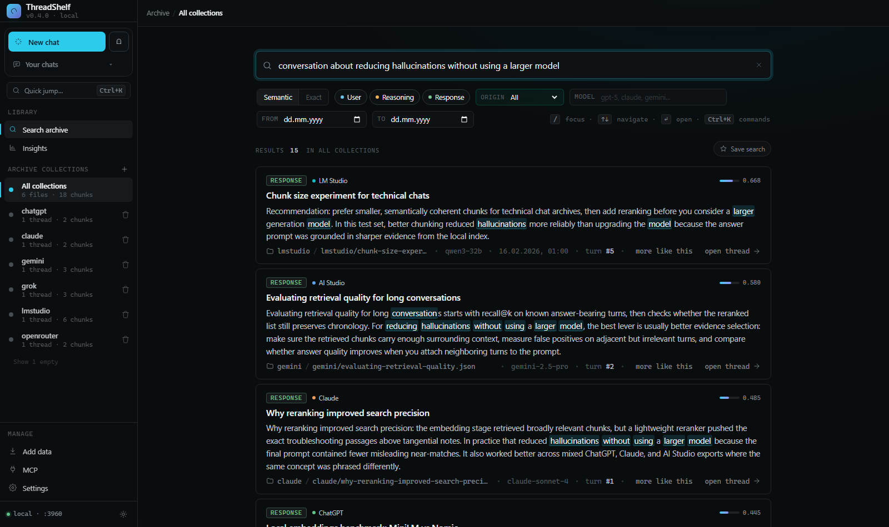
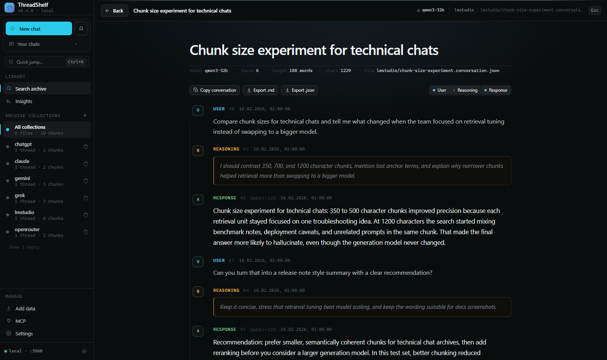
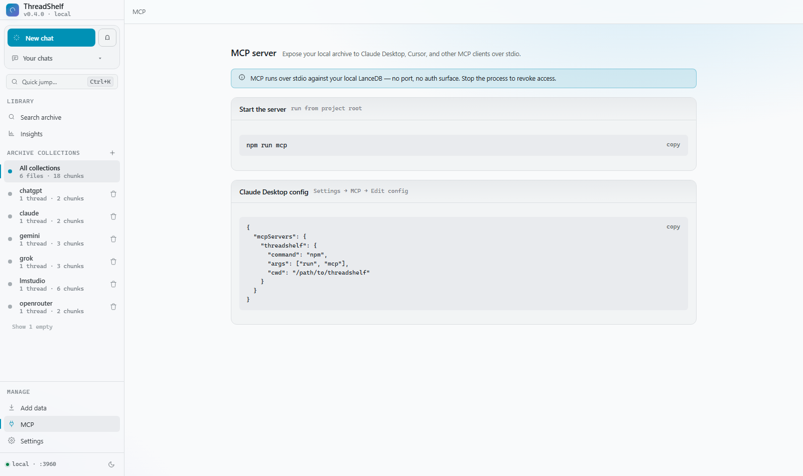

# ThreadShelf

**Local-first archive, semantic search, and continuation for your AI conversations.**

[](https://github.com/ChrystianSchutz/viewerHistoriLLM/actions/workflows/ci.yml)
[](package.json)
[](LICENSE)
[](#privacy-boundary)

One private workspace across **ChatGPT, Claude, Google AI Studio, OpenRouter,
LM Studio, and Grok**. Search old conversations by meaning, reopen the complete
thread, and continue it with a local GGUF model through `llama.cpp` or the
explicitly external OpenRouter provider.

The archive pipeline—parsing, embeddings, LanceDB storage, search, HTTP API, and
MCP—runs locally. Conversation generation is an **Experimental Alpha**:
`llama.cpp` stays loopback-only; switching to the clearly marked
**OpenRouter · external** provider sends the selected user/assistant context and
new prompt off-device.


| Capability              | What ThreadShelf provides                                                                                              |
| ----------------------- | ---------------------------------------------------------------------------------------------------------------------- |
| **Archive & retrieval** | Multi-provider normalization, local multilingual embeddings, semantic and exact search, complete thread reconstruction |
| **Continue & create**   | Local GGUF inference through managed `llama.cpp`, plus optional OpenRouter streaming                                   |
| **Use it anywhere**     | React UI, command-line ingest/search, HTTP API, and an MCP stdio server over the same index                            |
| **Keep control**        | Loopback defaults, isolated local storage, explicit off-device labeling, synthetic test data                           |

---

## What it does (in 30 seconds)

1. You export/copy your chats as JSON (see [Get your data](#get-your-data)).
2. ThreadShelf parses them into a common format, embeds them **locally**, and
   stores them in a local vector database (LanceDB).
3. You search by meaning in the web UI, open the full original thread, and export
   any conversation to Markdown — or query the same index from an MCP client.
4. Optionally start a new chat or continue an archived thread through local
   `llama.cpp` or explicitly external OpenRouter.

## Architecture at a glance



## How is this different from other history viewers?

- **One normalized archive across six providers.** It includes sources whose
  history is otherwise split between exports, Drive files, browser pages, and
  local application data.
- **Semantic, not just keyword.** Find a conversation by topic even when you don't
  remember the exact words — plus an exact-match mode for when you do (error
  strings, identifiers, code).
- **A local archive with an optional generation layer.** Search remains useful
  without configuring any LLM. When generation is wanted, the primary engine is
  a loopback-only `llama.cpp` server; OpenRouter is a separately marked external
  choice.
- **One index, three front-ends.** The same archive is searchable from the web UI,
  the HTTP API, and any MCP-capable tool.

## Supported sources

| Source                 | How export works                               | Format stability                     |
| ---------------------- | ---------------------------------------------- | ------------------------------------ |
| **Google AI Studio**   | Download your Drive "Google AI Studio" folder  | ⚠️ undocumented, tested July 2026    |
| **OpenRouter**         | Browser-console export script (this repo)      | ⚠️ undocumented                      |
| **LM Studio**          | Copy local conversation files                  | ⚠️ undocumented, tested on **0.4.x** |
| **Grok / xAI**         | Account data export (`prod-grok-backend.json`) | ⚠️ undocumented                      |
| **ChatGPT / OpenAI**   | Official data export (`conversations.json`)    | semi-stable                          |
| **Claude / Anthropic** | Official data export                           | semi-stable                          |

> ⚠️ **Format note.** Google AI Studio, OpenRouter, LM Studio, and Grok have no
> documented, stable export schema — their vendors can change it without warning.
> ThreadShelf is tested against snapshots of specific versions (e.g. LM Studio
> 0.4.x). If a newer app version changes the shape, parsing may break; please open
> an issue with an anonymized sample.

---

## Get your data

You only need the providers you actually use. Put exported files anywhere, then
point ThreadShelf at that folder.

### Google AI Studio

Your prompts are saved to **Google Drive** in a folder named **`Google AI Studio`**.

1. Open [Google Drive](https://drive.google.com), find the `Google AI Studio` folder.
2. Right-click → **Download** (Drive zips it). Unzip somewhere local.
3. Index that folder. (Files have no `.json` extension — that's fine, they're
   detected by content.)

Text chats and Imagen prompt histories from the July 2026 Drive export shape are
supported. The format is undocumented and may change.

### OpenRouter

OpenRouter has no bulk export, so this repo ships two browser-console scripts:

- **All chats:** [`scripts/openrouter-export-all.js`](scripts/openrouter-export-all.js)
  — walks every chat in your sidebar and downloads one JSON per chat.
- **Single chat:** [`scripts/openrouter-export-browser.js`](scripts/openrouter-export-browser.js)
  — exports just the chat currently open.

To export everything:

1. Open [openrouter.ai](https://openrouter.ai/) signed in, with your chat list
   (sidebar) visible.
2. Open DevTools → Console (`F12` → _Console_ tab).
3. Copy the entire contents of `scripts/openrouter-export-all.js`, paste into the
   console, press Enter.
4. The script clicks each chat, scrolls to load full history, and downloads one
   JSON per chat. Allow "**multiple downloads**" if the browser asks.
5. Move the downloaded files into a folder and index that folder.

> The selectors are pinned to OpenRouter's current chat UI and covered by
> `test/playwright/openrouter-export.spec.js`. If OpenRouter changes its markup and
> the script finds no chats, that test is where to update the contract.

You'll get a file shaped like this (this is what the parser reads):

```json
{
  "platform": "openrouter",
  "exportedAt": "2026-05-24T12:00:00.000Z",
  "pageTitle": "OpenRouter chat title",
  "sourceUrl": "https://openrouter.ai/chat/...",
  "turns": [
    { "role": "user", "content": "User message text" },
    { "role": "assistant", "content": "Assistant reply", "model": "optional/model-name" }
  ]
}
```

Verify a download before indexing:

```bash
npm run parse -- path/to/openrouter-export.json
```

See [docs/OPENROUTER.md](docs/OPENROUTER.md) for details and limitations.

### LM Studio

LM Studio stores **one JSON file per conversation** locally — no export step
needed, just point ThreadShelf at the folder (paths below):

| OS            | Path                                                 |
| ------------- | ---------------------------------------------------- |
| Windows       | `%USERPROFILE%\.lmstudio\conversations\`             |
| macOS / Linux | `~/.lmstudio/conversations/`                         |
| Older builds  | `~/.cache/lm-studio/conversations/` (check here too) |

Paste that path straight into the **manual folder path** box and index it — or copy
it somewhere first:

```bash
# macOS / Linux
cp -r ~/.lmstudio/conversations ~/lmstudio-export

# Windows (PowerShell)
Copy-Item "$env:USERPROFILE\.lmstudio\conversations" "$env:USERPROFILE\lmstudio-export" -Recurse
```

Files are named `<id>.conversation.json` and look like this (trimmed — the parser
reads `messages[].versions[currentlySelected]`, splitting `thinking` steps from the
answer):

```json
{
  "name": "My chat",
  "createdAt": 1700000000000,
  "lastUsedModel": { "identifier": "gpt-oss-20b" },
  "messages": [
    {
      "versions": [
        { "type": "singleStep", "role": "user", "content": [{ "type": "text", "text": "Hi" }] }
      ],
      "currentlySelected": 0
    },
    {
      "versions": [
        {
          "type": "multiStep",
          "role": "assistant",
          "steps": [
            {
              "type": "contentBlock",
              "style": { "type": "thinking" },
              "content": [{ "type": "text", "text": "reasoning…" }]
            },
            { "type": "contentBlock", "content": [{ "type": "text", "text": "Hello!" }] }
          ]
        }
      ],
      "currentlySelected": 0
    }
  ]
}
```

Conversation folders/subfolders are walked recursively. _Tested on LM Studio 0.4.x
(0.4.16); the format is undocumented and may change._

> **Note — LM Studio's local server ("router").** LM Studio can also run an
> OpenAI-compatible local server (Developer tab, default `http://localhost:1234`)
> that routes requests across loaded models. That's an _inference_ endpoint, not an
> export — ThreadShelf indexes the on-disk `conversations/` files above, so you
> don't need the server running to import or search your history.

### ChatGPT / OpenAI

ChatGPT → **Settings → Data controls → Export data**. You'll get an email with a
zip; index the `conversations.json` inside it.

### Claude / Anthropic

Claude → **Settings → export your data**. Index the exported conversation JSON.

### Grok / xAI

Grok → request your **account data export** (xAI account/privacy settings). You'll
get a download containing a `prod-grok-backend.json` somewhere under an
`export_data/.../` folder. Index the folder that contains it — ThreadShelf
detects the file by content, so the surrounding directory names don't matter.

The file holds every conversation in one document, shaped roughly like this (the
parser reads `conversations[].responses[].response`, splitting the model's
`agent_thinking_traces` reasoning from its `message` answer):

```json
{
  "conversations": [
    {
      "conversation": {
        "id": "…",
        "title": "My chat",
        "create_time": { "$date": { "$numberLong": "1771000000000" } }
      },
      "responses": [
        {
          "response": {
            "sender": "human",
            "message": "Hi",
            "create_time": { "$date": { "$numberLong": "1771000000000" } }
          }
        },
        {
          "response": {
            "sender": "assistant",
            "message": "Hello!",
            "model": "grok-3",
            "agent_thinking_traces": [{ "thinking_trace": "reasoning…" }]
          }
        }
      ]
    }
  ]
}
```

_Timestamps are MongoDB extended JSON (`{ "$date": { "$numberLong": … } }`). The
format is undocumented and may change._

---

## Quick Start

Requires **Node.js 20.19+** and npm.

```bash
npm install            # installs server + client (npm workspaces)
npm run build:client   # builds the React UI into public/
npm start              # serves on http://localhost:3000
```

Then in the browser:

1. **Create or select a collection** (think of it as a folder/project, e.g.
   `ai_studio`, `chatgpt`, `work_2026`). Start with a throwaway one.
2. **Select a folder** of exports, or paste an absolute folder path.
3. Click **Index folder** and watch live progress.
4. **Search** in natural language; use role filters (user / thinking / response).
   Switch **Semantic → Exact** for case-insensitive substring matches — best for
   identifiers, error messages, and code fragments the embedding model blurs.
5. **Click a result** to open the full source thread; copy or export to
   Markdown or JSON.

Use **Stop indexing** to cancel an active run. The current embedding batch is
allowed to finish safely; completed files stay indexed and an uncommitted file
keeps its previous index rows.

> First indexing is slow while the local embedding model downloads once, then it's
> cached. Working on the UI? `npm run dev` (backend) + `npm run dev:client` (Vite
> hot reload on :5173, API proxied to :3000).

For scheduled local backups or headless indexing:

```bash
npm run ingest -- path/to/exports work_2026
```

Omit the collection to use `chunks`. Add `--clear` only when you want to wipe the
collection before indexing.

To keep a folder indexed as it changes (LM Studio rewrites its conversation
files as you chat; AI Studio folders grow), add `--watch`:

```bash
npm run ingest -- ~/.lmstudio/conversations lmstudio -- --watch
```

After the initial pass the process stays running, watches the folder
recursively, and re-indexes just the files that changed (debounced; tune with
`--debounce <ms>`). Deleting a source file never removes it from the index —
ThreadShelf is an archive, and indexed conversations outlive their files.

You can also search straight from the terminal:

```bash
npm run search -- "that regex for polish postal codes"
npm run search -- "ECONNREFUSED 127.0.0.1" -- --mode keyword --n 5
npm run search -- "prompt injection" -- --collection work_2026 --json
```

The second `--` before CLI options is intentional: current npm versions can
otherwise consume option names that appear after positional arguments.

Full walkthrough: [docs/GETTING_STARTED.md](docs/GETTING_STARTED.md).

## Browse complete conversations



Click any result to open the full source thread, jump to the matched turn,
filter user/reasoning/response roles, copy text, or export the conversation to
Markdown or JSON. With no query, the search page lists all indexed
conversations with provider badges — sort them by recency, length, or title,
and narrow the list with the filter box.

- **More like this** — one click on any search result or thread turn runs a
  semantic search seeded with that passage, for "I know I discussed this
  somewhere else" moments.
- **Saved searches & pins** — star a query (with its filters and mode) to rerun
  it later, and pin conversations to keep them at the top of the browse list.
  Both are stored in your browser's localStorage; nothing leaves the machine.

## Experimental generation: llama.cpp + OpenRouter



> **Experimental Alpha.** The archive/search path is the stable release scope;
> generation interfaces and model compatibility may still change. Original
> export files are never modified.

Use **New chat** to start a locally saved ThreadShelf conversation, or open an
imported thread and choose **Continue this conversation**:

- **llama.cpp · local** — the primary engine. ThreadShelf discovers GGUF files,
  launches a loopback-only `llama-server`, streams tokens, reports CPU/GPU/hybrid
  placement, and can eject the model from memory without deleting it.
- **OpenRouter · external** — an optional provider with a live model catalog.
  Selecting this tab is the off-device choice: the model button carries an
  `off-device` chip and the composer says that the request is sent through
  OpenRouter. Archived `thinking` turns are excluded. Optional ZDR-only and
  data-collection-denial routing can reduce eligible providers.

Completed chats and archive continuations are stored locally, embedded, and
searchable. A ghost-icon **Private conversation** is tab-scoped and is never
written to the thread store or semantic index. Failed or stopped streams remain
in a clearly marked, unsaved recovery card for the current tab.

The model menu discovers common LM Studio, llama.cpp, and Hugging Face model
directories plus custom roots. It separates model selection from context/output
settings, supports favorites, and exposes detailed runtime logs only on demand.
Active streams hold a model lease so concurrent eject or configuration changes
cannot unload a model mid-response.

### Find or install llama.cpp safely

The setup command is cross-platform (Windows x64/ARM64, macOS x64/Apple Silicon,
Linux x64/ARM64 where official release assets exist). With no arguments it only
looks for `llama-server`; it does not make a network request, download, install,
or execute it:

```bash
npm run setup:llama
```

Inspect the newest compatible official release without downloading an archive:

```bash
npm run setup:llama -- -- --check
```

Install the current official `ggml-org/llama.cpp` release. The interactive form
requires typing `install`; automation requires the explicit `--yes` flag. The
official GitHub SHA-256 digest is verified and the MIT license/source metadata is
kept beside the installed files:

```bash
npm run setup:llama -- -- --install
npm run setup:llama -- -- --install --yes
```

Default builds are portable CPU builds (Metal is automatic on macOS). Accelerated
official variants may be selected with `--variant vulkan|cuda|rocm|sycl`; their
driver/runtime requirements still apply. Official variants are installed
side-by-side under release-and-variant folders,
so adding a GPU build never overwrites a working CPU build. Paste the desired
variant's printed `llama-server` path into Settings when more than one is present.
Autodiscovery prefers the newest managed release and an accelerator variant over
CPU for the same release; an explicitly configured executable still wins.

Official Windows CUDA releases split the server and CUDA runtime DLLs across two
archives. The CUDA install command downloads and SHA-256 verifies both. Re-running
the same explicitly approved command repairs an older ThreadShelf CUDA directory
that is missing the companion runtime without touching GGUF models:

```bash
npm run setup:llama -- -- --install --variant cuda
```

For Alpine, an unsupported architecture, or a custom build, provide your own
archive URL. Supplying `--url` is explicit download consent; provide a trusted
SHA-256 whenever possible:

```bash
npm run setup:llama -- -- --url https://example.invalid/llama-build.tar.gz --sha256 64_HEX_DIGEST --tag custom
```

The default destination is `.threadshelf/tools/`, which is gitignored. No model is
downloaded by this installer. Add existing GGUF directories and an optional
`llama-server` path in **Settings → Conversation generation**.

OpenRouter keys should preferably be supplied as `OPENROUTER_API_KEY` in the
gitignored root `.env` file (copy `.env.example`, then restart the server). A key
entered in the UI exists only in server memory for the current process and is
never written to `.threadshelf/generation.json` or returned by the API.

Generation configuration, created-chat storage, eject, and chat endpoints are
loopback-only even when the read/search UI is exposed with `HOST` and
`ALLOWED_HOSTS`. Full setup, persistence semantics, routing controls, runtime
diagnostics, and API examples are documented in
[Experimental Generation](docs/GENERATION_ALPHA.md).

## Archive insights

The **Insights** view charts your whole archive from data captured at ingest
time: activity over time, top models, turns per provider, and your longest
conversations — scoped to one collection or all of them.

## Dark theme





## Use it from MCP



ThreadShelf exposes your local index to MCP clients (e.g. Claude Desktop, or any
MCP-capable agent) over stdio — so a model can search your past chats as a tool.

```bash
npm run mcp   # starts the stdio MCP server
```

Example Claude Desktop config (`claude_desktop_config.json`):

```json
{
  "mcpServers": {
    "threadshelf": {
      "command": "npm",
      "args": ["run", "mcp"],
      "cwd": "/absolute/path/to/this/repo"
    }
  }
}
```

It reads the same local LanceDB the UI uses — no extra setup. See
[docs/MCP.md](docs/MCP.md) for the exposed tools.

## How it works

- **Collections** are local LanceDB tables (use them like folders/projects).
- **Threads** are full conversations reconstructed from the parsed export; search
  returns matching chunks, opening a result shows the whole thread.
- **Stored thread snapshots** keep indexed conversations readable after source
  files are moved, rewritten, or deleted.
- **Generation providers** implement one streaming contract over managed
  `llama.cpp` and OpenRouter, while per-thread leases and write locks protect
  concurrent saves and model transitions.

Internals: [docs/ARCHITECTURE.md](docs/ARCHITECTURE.md).

## Engineering and test coverage

ThreadShelf is an npm-workspaces TypeScript/ESM project with a React 19 client
and an Express 5 server. The full gate is deliberately broader than unit tests:

| Layer               | What is exercised                                                                                                                  |
| ------------------- | ---------------------------------------------------------------------------------------------------------------------------------- |
| **Unit/regression** | Provider parsing, Unicode, chunking, validation, generation config/runtime helpers, thread persistence, client utilities           |
| **API + MCP E2E**   | A real server, isolated temporary LanceDB/uploads/collections, ingest/search/thread/generation routes, and MCP stdio               |
| **Browser E2E**     | The built production UI in Chromium: search, routing, collections, uploads, generation streams, privacy labels, responsive layouts |
| **Repository gate** | Git/privacy hygiene, Markdown links, ESLint, TypeScript, client build, and all tests above                                         |

Every provider has small synthetic fixtures. Real exports are used only to learn
the JSON shape; private conversation content is never copied into the repository.
CI runs the full gate on Linux and lightweight core checks on Windows.

## Release status and important limitations

- Conversations indexed with the current version keep working (search, listing,
  and full thread view) even if the original export file is later moved,
  rewritten, or deleted — normalized turns are stored alongside the vectors at
  ingest time. Collections indexed with older versions still read threads from
  the original file path until you re-index them.
- Very large archives are supported in normal use, but >100k chunk collections
  should still be validated against your own data before relying on exact stats.
- Undocumented provider formats can change without notice; keep small
  anonymized fixtures for any real export shape that breaks parsing.
- Conversation generation is **Experimental Alpha**; archive indexing and search
  do not depend on it.
- ThreadShelf is a single-user local application. The HTTP API has no user
  accounts or authentication and should remain bound to loopback unless it is
  placed on a trusted network with deliberate host configuration.

## Scripts

| Command                                              | Description                                                                         |
| ---------------------------------------------------- | ----------------------------------------------------------------------------------- |
| `npm start`                                          | Start server on port 3000 (`npm start -- 3001` for another port).                   |
| `npm run dev`                                        | Server with file watch.                                                             |
| `npm run dev:client`                                 | Vite dev server (UI hot reload on :5173).                                           |
| `npm run build:client`                               | Build the UI into `public/`.                                                        |
| `npm run check`                                      | Full gate: repo hygiene, lint, typecheck, unit + API/MCP E2E, build, Playwright.    |
| `npm run check:repo`                                 | Reject tracked private artifacts/secrets before commit.                             |
| `npm test`                                           | Fast unit/regression tests.                                                         |
| `npm run test:e2e`                                   | API + MCP E2E with a temporary server and LanceDB.                                  |
| `npm run test:playwright`                            | Browser E2E (needs `npm run build:client` + Playwright).                            |
| `npm run mcp`                                        | Start the MCP stdio server.                                                         |
| `npm run parse -- <file> -- [flags]`                 | Parse one export file (`--no-user`, `--no-thinking`, `--no-ai`).                    |
| `npm run ingest -- <folder> [collection] -- [flags]` | Ingest a folder (`--clear`, `--watch`, `--debounce <ms>`).                          |
| `npm run search -- "<query>" -- [flags]`             | Search from the CLI (`--mode keyword`, `--collection`, `--roles`, `--n`, `--json`). |
| `npm run setup:llama`                                | Discover local `llama-server`; add `-- -- --check` or explicit install flags.       |

Missing Playwright browsers? `npx playwright install chromium`.

## Configuration (optional env vars)

| Variable                                  | Default                            | Purpose                                                               |
| ----------------------------------------- | ---------------------------------- | --------------------------------------------------------------------- |
| `PORT`                                    | `3000`                             | Server port.                                                          |
| `HOST`                                    | `127.0.0.1`                        | Server host. Set explicitly only when trusted LAN access is required. |
| `ALLOWED_HOSTS`                           | _(empty)_                          | Comma-separated extra Host/Origin names for trusted LAN access.       |
| `LANCEDB_PATH`                            | `.lancedb`                         | LanceDB directory.                                                    |
| `UPLOADS_DIR`                             | `.uploads`                         | Uploaded source files.                                                |
| `COLLECTIONS_PATH`                        | `.collections.json`                | Manual-collections registry file.                                     |
| `CHUNK_MAX_CHARS`                         | `2000`                             | Max characters per embedded chunk.                                    |
| `CHUNK_OVERLAP_CHARS`                     | `100`                              | Overlap between long chunks.                                          |
| `EMBED_BATCH_SIZE`                        | `25`                               | Embedding batch size during ingest.                                   |
| `GENERATION_CONFIG_PATH`                  | `.threadshelf/generation.json`     | Non-secret Experimental Alpha generation settings.                    |
| `MASTER_PROMPTS_PATH`                     | `.threadshelf/master-prompts.json` | Saved master (system) prompts.                                        |
| `LLAMA_CPP_SERVER`                        | _(auto)_                           | Absolute path to an existing `llama-server` executable.               |
| `LLAMA_CPP_BASE_URL`                      | _(empty)_                          | Existing loopback-only llama.cpp server URL.                          |
| `LLAMA_CPP_CONTEXT_SIZE`                  | `8192`                             | Managed local server context size.                                    |
| `LLAMA_CPP_ACCELERATION`                  | `auto`                             | `auto`, `cpu`, `gpu`, `hybrid`, or `multi-gpu`.                       |
| `LLAMA_CPP_GPU_LAYERS`                    | `20`                               | Exact layer offload for the hybrid profile.                           |
| `LLAMA_CPP_SPLIT_MODE`                    | `layer`                            | Multi-GPU split: `layer` or `row`.                                    |
| `LLAMA_CPP_MAIN_GPU`                      | `0`                                | Main GPU index for applicable profiles.                               |
| `LLAMA_CPP_TENSOR_SPLIT`                  | _(empty)_                          | Optional multi-GPU proportions, e.g. `3,1`.                           |
| `LLAMA_CPP_THREADS`                       | `-1`                               | CPU generation threads; `-1` lets llama.cpp choose.                   |
| `LLAMA_CPP_FLASH_ATTENTION`               | `auto`                             | Flash Attention: `auto`, `on`, or `off`.                              |
| `LLAMA_MODEL_PATHS`                       | _(defaults)_                       | Extra model roots (`;` on Windows, `:` on macOS/Linux).               |
| `THREADSHELF_TOOLS_PATH`                  | `.threadshelf/tools`               | llama.cpp discovery/installer root.                                   |
| `THREADSHELF_DISABLE_DEFAULT_MODEL_PATHS` | `0`                                | Set `1` to scan only explicitly configured roots.                     |
| `OPENROUTER_API_KEY`                      | _(empty)_                          | OpenRouter key; may be set in `.env`, never exposed to the browser.   |
| `OPENROUTER_BASE_URL`                     | `https://openrouter.ai/api/v1`     | Override primarily intended for testing.                              |

For LAN access, bind to the interface you need and allow the exact browser host,
for example `HOST=0.0.0.0 ALLOWED_HOSTS=192.168.1.50,my-pc.local`. Without
`ALLOWED_HOSTS`, API requests from other machines are rejected by Host/Origin
checks.

## Documentation

- [Getting Started](docs/GETTING_STARTED.md) — install, run, index, search.
- [Architecture](docs/ARCHITECTURE.md) — data flow, modules, storage, API.
- [MCP Setup](docs/MCP.md) — run the stdio MCP server and what it exposes.
- [OpenRouter Export](docs/OPENROUTER.md) — the browser export flow + limitations.
- [Experimental Generation](docs/GENERATION_ALPHA.md) — llama.cpp/OpenRouter setup, privacy, and API.
- [Real Data Testing](docs/REAL_DATA_TESTING.md) — validate private exports safely.
- [FAQ](docs/FAQ.md) — common questions.
- [Changelog](CHANGELOG.md) — release highlights.
- [AGENTS.md](AGENTS.md) — guidance for AI coding agents and contributors.

## Privacy boundary

Indexing, embeddings, storage, search, MCP, and llama.cpp inference are local.
The explicitly selected **Experimental Alpha OpenRouter generation is not
local**: it sends the selected archive or ThreadShelf chat's user/assistant
history and prompt to OpenRouter and
the routed provider. **Do not commit real chat exports, uploaded files, local
databases, `.threadshelf/`, logs, or temp folders** — `.gitignore` excludes them.
`npm run check:repo` also rejects these paths if they become commit candidates.
Fixtures in `test/fixtures/` are synthetic and anonymized. See
[SECURITY.md](SECURITY.md).

## Contributing

See [CONTRIBUTING.md](CONTRIBUTING.md): add tests for parser/ingest/search changes,
keep real exports out of git, and run `npm run check` before opening a PR.

## License

MIT — see [LICENSE](LICENSE).
